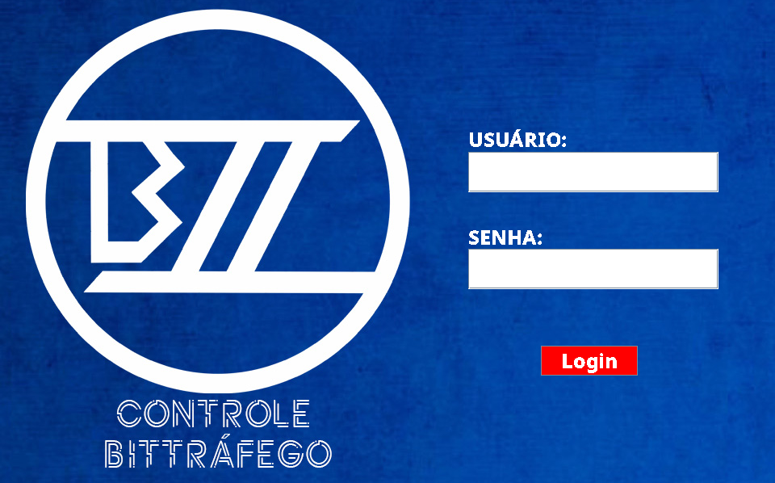
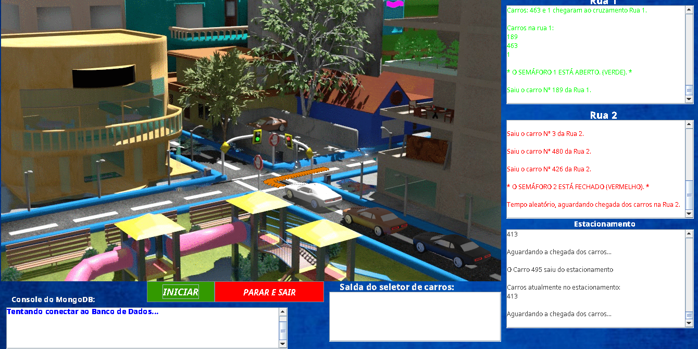

# Estrutura-de-Dados-1_Controle-Bittrafego

Arquivo do projeto "Controle Bittráfego" criado para a matéria de Estrutura de Dados 1.

## Descrição

Controle Bittráfego é um projeto que utiliza conceitos de Estrutura de Dados 1 para simular um cruzamento com semáforos, e um estacionamento. Para isso, ele se utiliza de estruturas como Pilhas e Filas, onde o cruzamento utiliza uma Fila para cada rua, e o Estacionamento, uma Pilha apenas. O desenfileiramento das ruas ocorre de acordo com a situação dos semárofos, que assim como a chegada de carros nas ruas (que possui um elemento de aleatoriedade), atua por meio de um Timer. O estacionamento por sua vez é relativamente desacoplado do funcionamento do cruzamento, empilhando e desempilhando aleatoriamente conforme um Timer.

O projeto possui compatibilidadae com o MongoDB, permitindo salvar os históricos do estacionamento e do cruzamento em um banco de dados, mas essa funcionalidade não foi testada novamente na data de upload deste projeto para o Github.

## Processo de compilação

O projeto pode ser compilado tanto pelo Apache Netbeans, quanto pelo Java Ant, seja no Windows, Linux, ou qualquer outra plataforma. Porém, apenas Windows e Linux foram testados. Para utilizar o Apache Netbeans, basta abrir o conteúdo deste repositório como um projeto neste, e compilar o projeto como normalmente é feito na ferramenta, já para o Java Ant, aponte seu terminal ou console para a pasta do projeto (build.xml deve estar na raíz) e execute "ant jar" para gerar os arquivos binários.

Entretanto, a pasta `dist/` do repositório possui arquivos pré-compilados caso queira apenas executar o programa para verificar o funcionamento. As credenciais para a tela de login são:

* Usuário: `admin`
* Senha: `123`

## Desenvolvedores do projeto

* `Paulo César de Morais Sousa`
* `Matheus Rondón Fernandes Cardoso`
* `Daniel Elias Batista de Deus`

## Imagens de funcionamento

